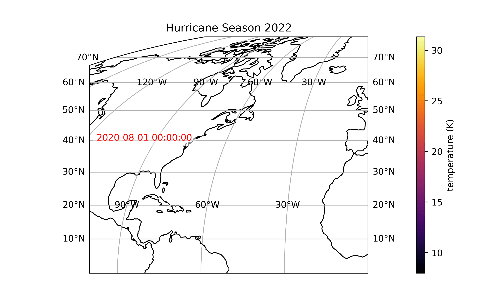

[](https://mybinder.org/v2/gh/Cloud-Drift/hurdat2-get-started/HEAD)



> The thicker lines represent the storm tracks while the thinner lines represent the drifters. We plot only the last 20 or so point of the drifter trajectories and color the track based on the mean temperature of those points

# hurdat2-get-started (experimental)
This repository contains a notebooks to get you started with the [HURDAT2 dataset](https://www.aoml.noaa.gov/hrd/hurdat/Data_Storm.html) using python and the [*xarray* library](https://docs.xarray.dev/en/stable/). 


## Using experimental examples
1. Install the dependencies for the notebook and clouddrift:
```bash
conda env create -n hurdat2-get-started -f environment.yaml
conda env update -n hurdat2-get-started --file dependencies/clouddrift/environment.yaml
```

2. Initialize the clouddrift git sub module
```bash
git submodule init
git submodule update
```

Utilize the `hurdat2-get-started` environment for the notebooks